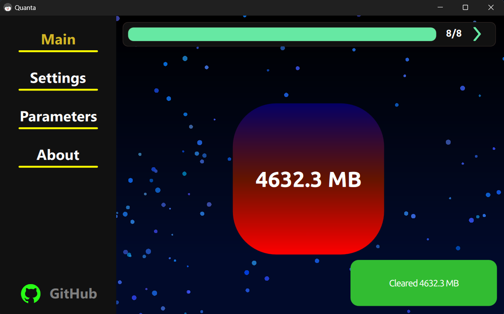
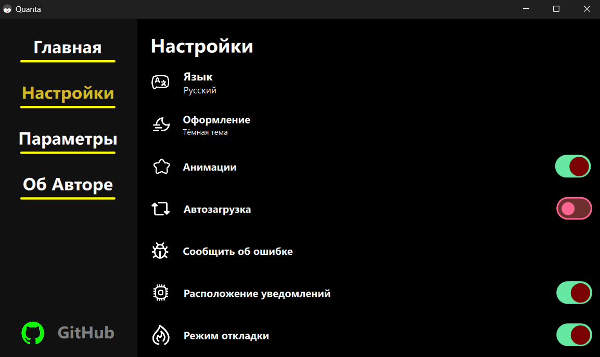
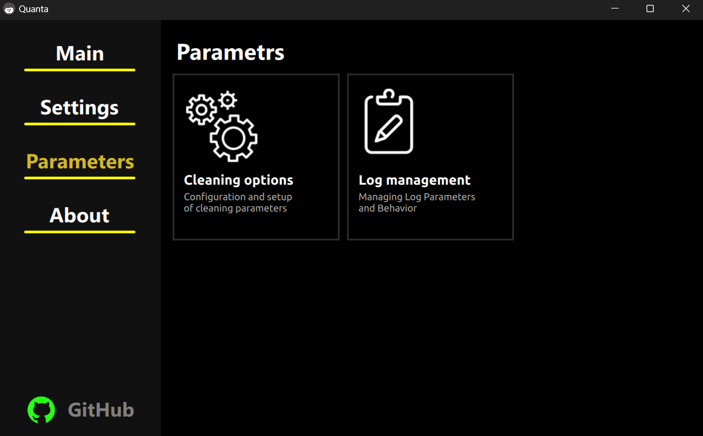

# 🔥 Quanta Cleaner

**Quanta Cleaner** is a fast, smart, and elegant garbage cleaner for Windows. Designed with performance and safety in mind, it sweeps away unnecessary junk to keep your system fresh and responsive — all with just one click.

---

## 🚀 Features

- ⚡ **Lightning-fast scanning** — No waiting around. Finds junk in seconds.
- 🗑️ **Cleans temp files, logs, cache**, and other clutter.
- 🧠 **Smart file selection** — avoids critical system files.
- 🎯 **Custom rules** — You decide what stays and what goes.
- 🧼 **Minimal UI, maximum clarity** — Simple and intuitive interface.
- 🔐 **Safe by design** — Nothing gets deleted without your permission.

---

## 🖼️ Screenshots

  
  
  

---

## 🖥️ Tech Stack

- **C++ / Qt 6 (quick)**
- Clean, modern UI
- Lightweight, no dependencies, no bloat

---

## 🛠️ How to Start

1. 🚀 Go to the [**Releases**](https://github.com/iUnreallx/Quanta-Cleaner/releases) section.
2. ⬇️ Download the latest archive file for Windows.
3. ✅ Run it — and watch your system get clean in seconds.

> No installation required. Lightweight, portable, and safe.

---

## 🤝 Contributing

Want to help make **Quanta Cleaner** even better?

Whether it's fixing bugs, suggesting features, improving UI, or just sharing ideas — your input is welcome!

- 🛠️ Fork the repo — `gh repo fork https://github.com/iUnreallx/Quanta-Cleaner`
- 📥 Submit a pull request — `git push && open PR`
- 💬 Open an issue — `gh issue create --repo https://github.com/iUnreallx/Quanta-Cleaner`

👉 [Start contributing here](https://github.com/iUnreallx/Quanta-Cleaner)

Star this please <3
